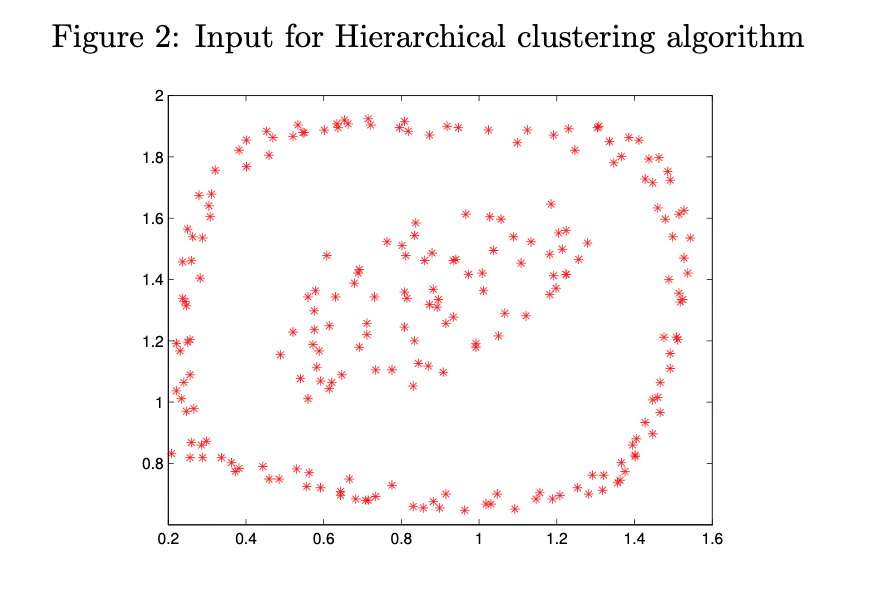
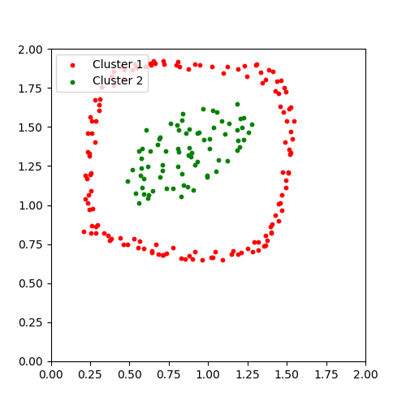

# Hierarchical Clustering
My solution to a hierarchical clustering problem from COMP 6600 (Artificial Intelligence) at Auburn University. We were tasked with reading in a set of coordinates from a text file (B.txt) and implementing a solution to cluster them together based on distance.

## Input before clustering:

All the points on the chart begin in clusters by themselves. There is no grouping at all.

## Output after clustering:

After running the Hierarchical Clustering algorithm, there are now two distinct clusters based on distance.

## Strategy

The general strategy for implementing hierarchical clustering is to start each point in a group by itself. Then find the two groups that are closest together and merge them into a new group. Repeat this process until there remains only one group containing sub-groups of each other point.

I took an object-oriented approach by creating Point and Group objects, where Groups are made up of Points that have x and y coordinate values.

## Areas for improvement:
* Currently, my distanceToGroup method begins with a "smallest distance" value of 999. In the scope of this problem, all of the points had distances less than 2 from any other. Obviously this would not scale to a general-use solution.
* When searching for the nearest two groups, I compare each group to every other group. This results in an `O(n²)` time complexity and would also need to be improved for any scalability.
